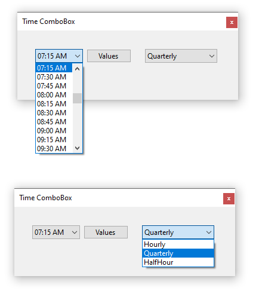

# Hours class

Provides the ability to create an array of time formatted AM/PM in hours e.g. `hh:mm tt`, quarter hour and half hour.


# TimeComboBox

A ComboBox which provides the ability to display hours based off `Hours` class.



---


## Properties


| Property  | Description |
| :--- | :--- |
|SetCurrentItem|Set current item in the ComboBox using a TimeSpan. |
|SetCurrentItem|Set current item by string which represents a valid TimeSpan|
|TimeSpan|Get current selected item as a TimeSpan|
|SelectedHour|Get hour for selected item|
|IsAM|Determine if current selected item is AM|
|IsPM|Determine if current selected item is PM|
|Increment|Set increment by TimeIncrement|
|Time|get/set time|

# Date helper extensions for TimeComboBox


| Extension  | Description |
| :--- | :--- |
| RoundedQuarterly | closest past quarter hour |
| RoundedUpHour | upcoming hour |
| CurrentHour | current hour |
|Minutes|Get minutes for selected item|


## Examples

```
Debug.WriteLine(Now.RoundedQuarterly().ToString(Hours.TimeFormat))
Debug.WriteLine(Now.RoundedUpHour().ToString(Hours.TimeFormat))
Debug.WriteLine(Now.CurrentHour())
```


# Miscellaneous extensions

TODO
