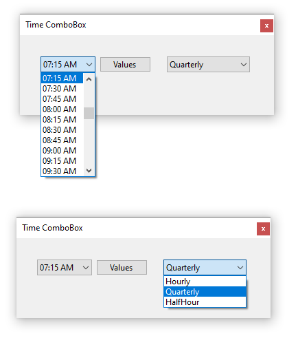
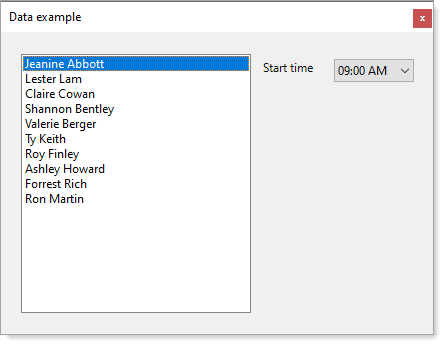

# About

.NET Framework has a DateTimePicker but not a control to work with TimeSpan which is what TimePickerComboBox was created for.

TimePickerComboBox provides the ability to display time by hour, quarter hour or half-hour using an enum. 

- To manually set the time use [SetCurrentItem](https://github.com/karenpayneoregon/time-combobox-vbnet/blob/master/HoursLibrary/TimePickerComboBox.vb#L42) using a TimeSpan or using an overload for a string.
- To get the current time as a TimeSpan use [TimeSpan](https://github.com/karenpayneoregon/time-combobox-vbnet/blob/master/HoursLibrary/TimePickerComboBox.vb#L82) property.
- To get the current hour as an integer use [SelectedHour](https://github.com/karenpayneoregon/time-combobox-vbnet/blob/master/HoursLibrary/TimePickerComboBox.vb#L82) and [Minutes](https://github.com/karenpayneoregon/time-combobox-vbnet/blob/master/HoursLibrary/TimePickerComboBox.vb#L104) to get current minutes as an integer.
- To determine if the current value is am or pm use [IsAm](https://github.com/karenpayneoregon/time-combobox-vbnet/blob/master/HoursLibrary/TimePickerComboBox.vb#L114) or [IsPm](https://github.com/karenpayneoregon/time-combobox-vbnet/blob/master/HoursLibrary/TimePickerComboBox.vb#L126)
- To set the increment use [Increment](https://github.com/karenpayneoregon/time-combobox-vbnet/blob/master/HoursLibrary/TimePickerComboBox.vb#L139) property

# Hours class

Provides the ability to create an array of time formatted AM/PM in hours e.g. `hh:mm tt`, quarter hour and half hour.

# TimeComboBox

A ComboBox which provides the ability to display hours based off `Hours` class.

## Working with SQL-Server

