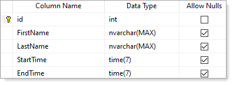
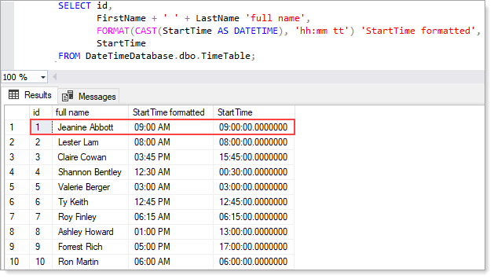

# TimePickerComboBox (VB.NET)

.NET Framework has a `DateTimePicker` but not a control to work with `TimeSpan` which is what `TimePickerComboBox` was created for.

TimePickerComboBox provides the ability to display time by hour, quarter hour or half-hour using an enum. 

- To manually set the time use [SetCurrentItem](https://github.com/karenpayneoregon/time-combobox-vbnet/blob/master/HoursLibrary/TimePickerComboBox.vb#L42) using a TimeSpan or using an overload for a string.
- To get the current time as a TimeSpan use [TimeSpan](https://github.com/karenpayneoregon/time-combobox-vbnet/blob/master/HoursLibrary/TimePickerComboBox.vb#L82) property.
- To get the current hour as an integer use [SelectedHour](https://github.com/karenpayneoregon/time-combobox-vbnet/blob/master/HoursLibrary/TimePickerComboBox.vb#L82) and [Minutes](https://github.com/karenpayneoregon/time-combobox-vbnet/blob/master/HoursLibrary/TimePickerComboBox.vb#L104) to get current minutes as an integer.
- To determine if the current value is am or pm use [IsAm](https://github.com/karenpayneoregon/time-combobox-vbnet/blob/master/HoursLibrary/TimePickerComboBox.vb#L114) or [IsPm](https://github.com/karenpayneoregon/time-combobox-vbnet/blob/master/HoursLibrary/TimePickerComboBox.vb#L126)
- To set the increment use [Increment](https://github.com/karenpayneoregon/time-combobox-vbnet/blob/master/HoursLibrary/TimePickerComboBox.vb#L139) property

# Helpers

There are several language extensions to assist working with Date and TimeSpan types [found here](https://github.com/karenpayneoregon/time-combobox-vbnet/blob/master/LanguageExtensions.md).

# SQL-Server example

Before running create the required database and tables using the following [script](https://github.com/karenpayneoregon/time-combobox-vbnet/blob/master/script.sql).

# Hours class

Provides the ability to create an `array of time` formatted `AM/PM` in hours e.g. `hh:mm tt`, quarter hour and half hour.

# TimePickerComboBox

A ComboBox which provides the ability to display hours based off `Hours` class.

## Working with SQL-Server

In this code sample data is read from a SQL-Server database table where time columns are of type [time(7)](https://docs.microsoft.com/en-us/sql/t-sql/data-types/time-transact-sql?view=sql-server-ver15). 

A ListBox data source is set to a list of a model via a BindingSource then on position change the TimePickerComboBox is updated to the current item StartTime column value.

On selection change event of the TimePickerComboBox the StartTime value is updated in the data source.

Other options would be data binding a property in the TimePickerComboBox.

# C# version

See the following `Microsoft TechNet article` [Working with SQL-Server time type in Windows forms](https://social.technet.microsoft.com/wiki/contents/articles/52218.c-working-with-sql-server-time-type-in-windows-forms.aspx)